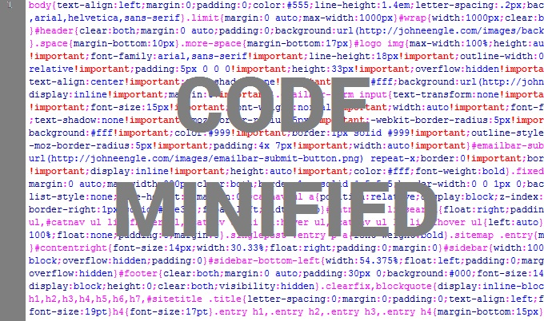

<h1 align="center"><br> Minified.js</h1>

<p align="center">
  <a href="https://github.com/kamranahmedse/driver.js/blob/master/license">
    
  </a>
  <a href="http://twitter.com/Code3Hr">
    
  </a>
</p>

<p align="center">
  <b>Powerful yet light-weight, vanilla JavaScript engine to minify any source code, though making it run faster</b></br>
  <sub>Only ~4kb, no external dependency and highly customizable <sub>
</p>

<br />

## Run Application

#### Install node
you can download it from https://nodejs.org/en/download/
#### Usage
Demo
```shell
	$ git clone https://github.com/code3hr/Minifiedjs.git
	$ cd the directory
	$ open cmd in pwd 
	$ node minified.js test.js
	$ this should produce min_test.js
```


